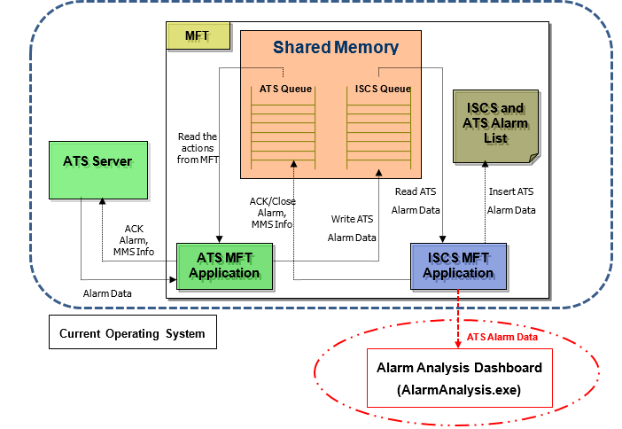
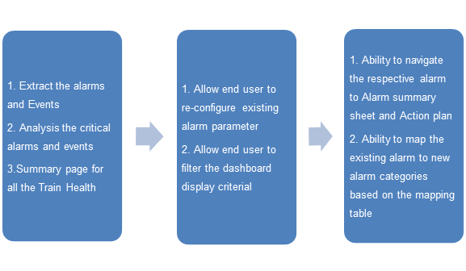
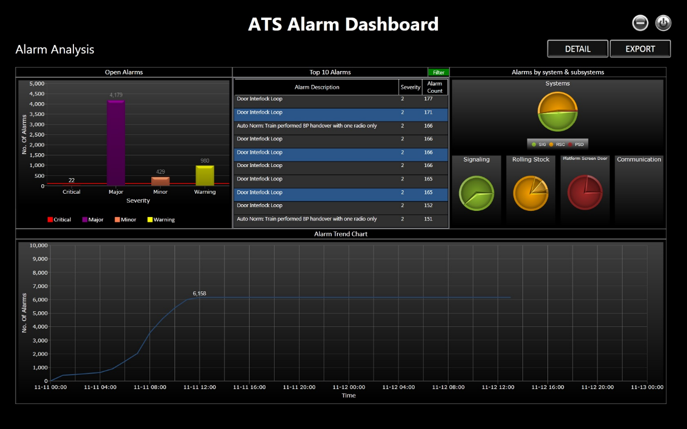
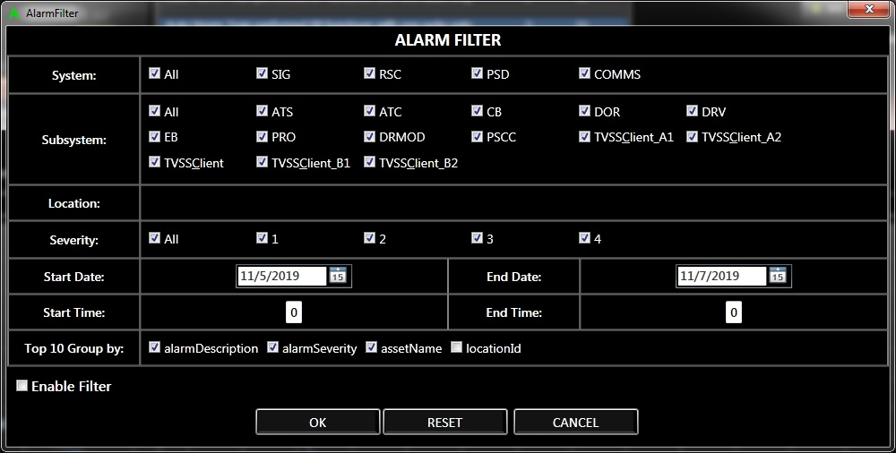
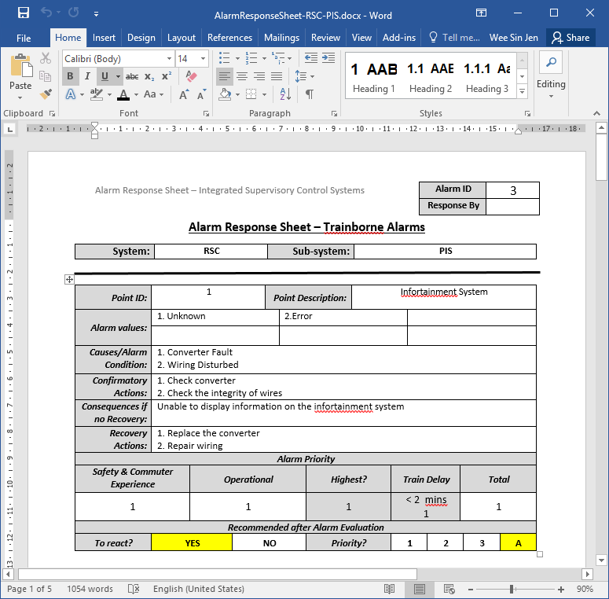
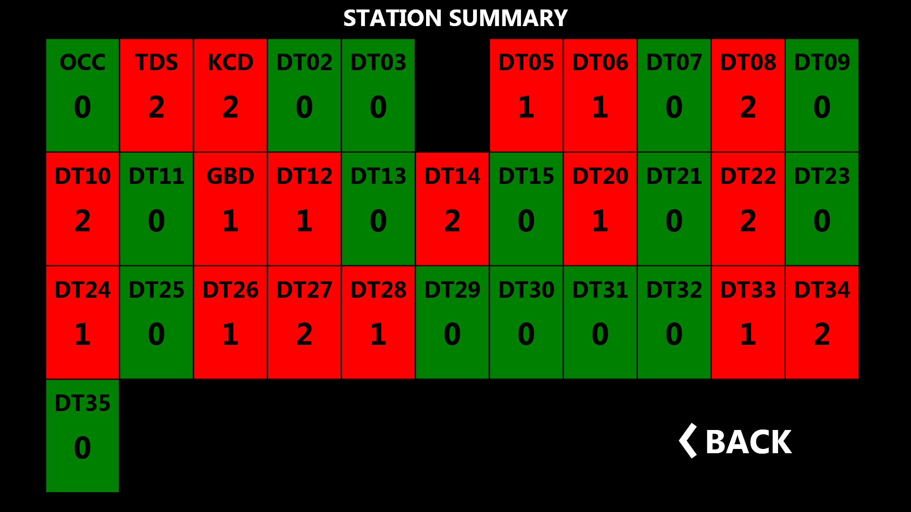
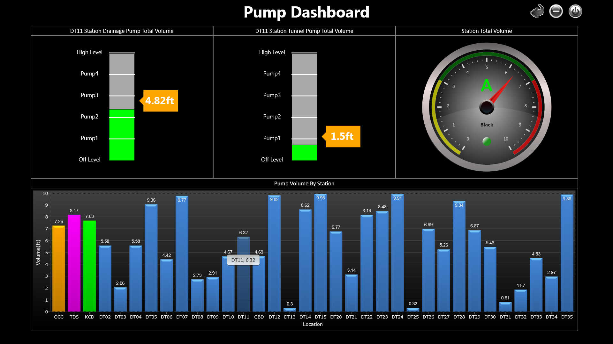

# Singapore Downtown Line Alarm Analysis Application
Alarm Analysis is a BI software which designed to retrieve, analyze, transform and report alarm data. Data mining is used in doing analysis for alarms. It provide a Graphical User Interface (GUI) of the Integrated ATS Alarm Analysis dashboard and satisfy the requirements outlined by the maintenance control operators at SBST. 

# Background
The objective of the Alarm Analysis tool is aimed to further analyze the alarms under ISCS system, to provide the users and operators with a more useful set of data representation. It is also aimed to increase the usability in view of the high volume of alarms received at any point of time. The most usability problem is that there are too many alarms annunciated in the currently operating system and this causes a high possibility of alarm flood.
+	Introduce alarm dashboard from the existing system
+	Extract and Further Analysis the critical alarms and event from existing alarm & event database.

The benefit of the ATS Alarm Analysis Dashboard as below:
+	To provide the users and operators with a more useful set of data representation.
+	To increase the usability in view of the high volume of alarms received at any point of time.
+	Expendable to include other subsystems eg. COMMS, ISCS

# Design
There will be two main components under this software. Alarm Dashboard (Alarm Analysis.exe) and AlarmStore.

The Figure above shows the existing shared memory model for alarms in the ISCS system and the added-on feature for the Alarm Analysis tool. 

When the ATS server gets any alarm from its subsystems:
1)	ATS server passes the Alarm Data (filtered based on login profile) to ATS MFT Application through its internal interface.
2)	ATS MFT Application appends the alarm information into ISCS Queue in the Shared Memory
3)	ISCS MFT Application monitors the ISCS Queue, and reads the data from this queue immediately after any change of the Queue applied
4)	ISCS MFT Application inserts the ATS Alarm Data into the common ISCS and ATS Alarm List which hold by ISCS and shows the alarm in MFT GUI.
Added-on function from Alarm Analysis Tool:  
ISCS MFT Application Save the ATS alarm Data to the dedicated folder and the Alarm Analysis tool will analysis the alarms and display the data on the Alarm Analysis Dashboard. There will be NO command or control from the Alarm Analysis Tool as it will only be used to extract the data for analysis purposes.
5)	ISCS MFT deletes the processed data from ISCS Queue

# Roadmap
The dashboard design divided into 3 phases as below:

##	Phase 1 Design 
a)	Alarm refresh rate
The alarm Store refresh rate is configure as 3000 ms  
b)	Data Storage
The small data file will be created to store 7 days of data.

##	Phase 2 Design - Alarm Dashboard
Alarm dashboard page also have the filter function. This provide the flexibility to the user to select the information that desire to display.

##	Phase 3 Design - Alarm Mapping and Lookup Table

###	Ability to Navigate to Alarm Response Sheet 

In the alarm summary list, the software shall provide the navigation for the alarm to the respective Alarm Response Sheet.  
The response sheet will be classified by few categories based on the System and Subsystem. The table below show the system and subsystem for the ATS alarm.  
The Response sheet will created on Microsoft Word document format (*docx) and keep in one common folder.
Eg. For Alarm Response Sheet for System – RSC, Subsystem – BRK 
  	      <<AlarmResponseSheet-RSC-BRK.docx>>  

The software will call out the respective Response Sheet based on the alarm system and subsystem.  

### Ability to Map the Existing Alarm severity to New Alarm Severity 

The software shall able to convert the existing alarm severity to the new severity based on the lookup table. The lookup table can be saved in .csv file format and loaded into the system.
The parameters will be used for the lookup table for the alarm mapping shall be as below:
1)	System
2)	Subsystem
3)	Alarm type
4)	Equipment ID
5)	Description
6)	Severity
7)	Alarm State
# Station Summary Page
Black station mean this station is not in operation yet.

# Pump Dashboard
This dashboard also integrate pump monitor page, include both station pumps and tunnel pumps. This page  show all station pumps water lever, will trigger alarm if reach the threshhold: 

# Folder Structure
- AlarmanalysisService: Background service to retrieve and analysis alarms from ISCS and ATS side
- AtsAlarmAnalysis: Dashboard for AtsAlarmAnalysis, it is train alarm, which is more critical.
- IscsAlarmAnalysis: Dashboard for IscsAlarmAnalysis, it is all device alarms except train alarm, numerous subsystem included.

Since this project need irregular GUI, so WPF framework is used.

# License
This Application is under the GPL license. See the [LICENSE](LICENSE) file for details..